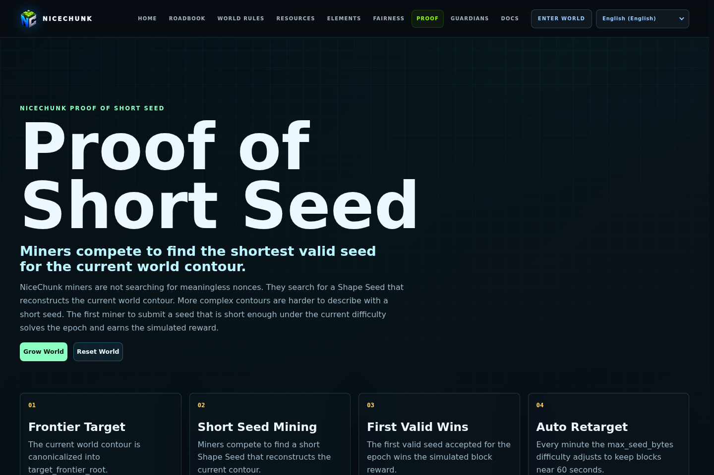

# NiceChunk Proof of Frontier

Reference implementation and explanation for frontier-style proof logic.

## Project Overview

This repository contains the Proof of Frontier reference page and TypeScript implementation. It explores how a player or system can reason about frontier discovery and verifiable expansion in a generated world.

The project is currently a reference and explanation surface rather than a final consensus mechanism. It gives developers a place to inspect the algorithm independently from the main game client.

The code and page are kept together so algorithm changes can be explained with visible examples.

## System Principles

- Proof logic should be deterministic and replayable.
- Inputs and outputs should be visible enough for developers to reason about failure cases.
- The implementation should stay portable so scripts, pages, or future programs can compare behavior.
- The page should explain constraints without overstating production security.

## How It Works

- Open the proof page and inspect the reference flow.
- Read the TypeScript implementation to understand how inputs are transformed into proof data.
- Use the page to validate algorithm changes before wiring them into gameplay or chain flows.
- Keep examples aligned with current world generation assumptions.

## Why This Project Matters

Exploration needs more than visual discovery if it becomes part of a public economy. Proof of Frontier is one path toward making discovery state more verifiable.

A separate repository allows protocol designers and world designers to iterate on the concept without changing unrelated gameplay systems.

## Repository Layout

- `proof-of-frontier/`
- `src/lib/proof-of-frontier.ts`

## Development Workflow

1. Clone the repository and inspect the focused source tree before changing shared contracts or generated artifacts.
2. Keep changes scoped to the domain of this repository. Cross-domain changes should be coordinated through the matching split repositories.
3. Run the smallest meaningful validation for the touched surface: build checks for programs, browser checks for pages, or fixture checks for deterministic libraries.
4. Update screenshots and documentation when behavior, visible UI, public constants, or developer-facing workflows change.

## Future Development Direction

- Add deterministic fixtures and property tests.
- Define threat models and explicit non-goals.
- Explore integration with chunk state and Guardian proofs.
- Document how frontier proofs could be submitted, challenged, or indexed in future protocol versions.

## Maintenance Notes

This repository is a focused split from the main NiceChunk working tree. Keep the public surface explicit: avoid committing private keys, wallet files, deployment-only scripts, machine-specific configuration, or generated build artifacts. Runtime user-facing copy should stay behind the i18n layer where the project has an i18n surface.
